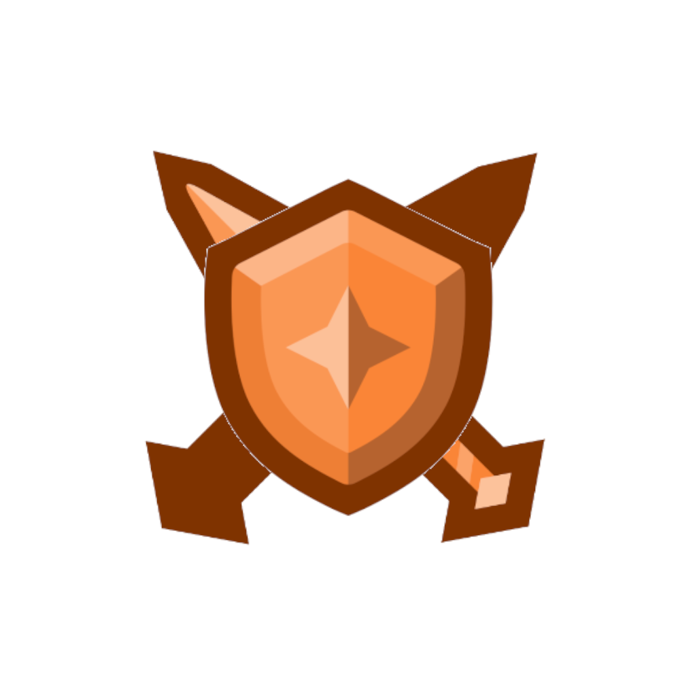

</img>

# habitica-desktop
## description
very simple, cross-platform [habitica](https://habitica.com) client.
 I was inspired by [Rectangle](https://rectangleapp.com/)'s [new feature](https://github.com/rxhanson/Rectangle/releases/tag/v0.49) that flows user-specific "todo app" on the side of the screen.

## screenshot

## building
1. clone the repository
2. go to the root of the repository (~/Downloads/habitica-desktop/ for example)
3. run `yarn install` (using yarn instead of npm is recommended since electron-builder, one of the dependencies of this project recommends.)
4. run `npm run pack` to build
5. the app will be located under ./dist/\<your-operating-system\>/

## Todos
* Add fireword effect triggered when user has completed a task
* Tweak the color of negative button in "Habits" category in order not to make it outstanding.